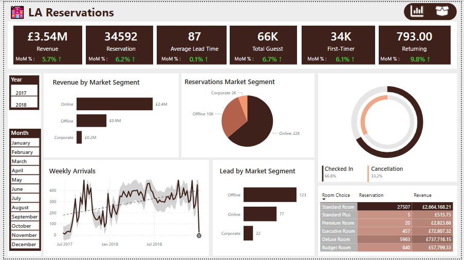
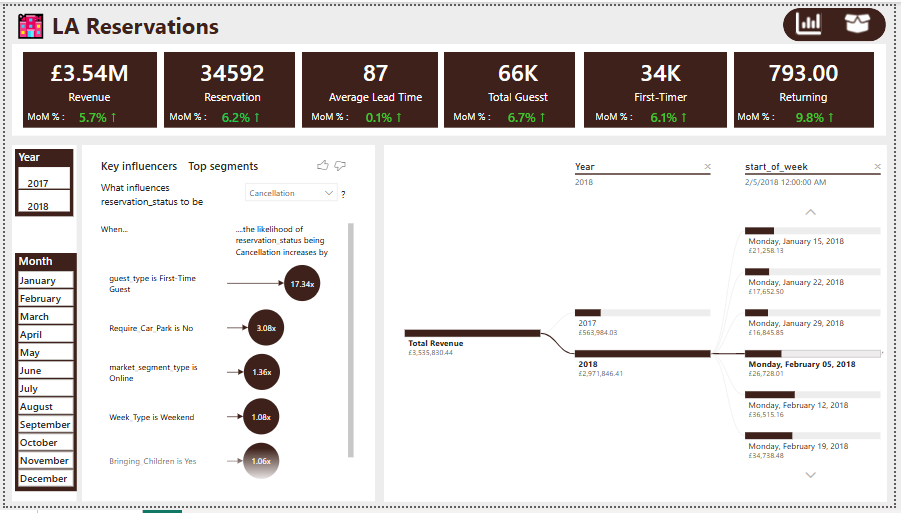
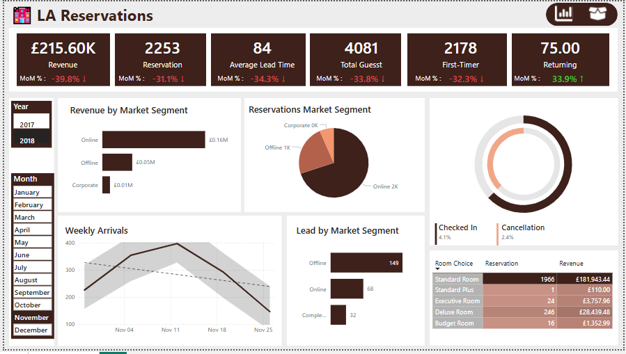

# Booking Report with Power BI

This project features a Power BI dashboard developed to visualize key business metrics for booking dataset, including revenue, visitors and checked in turned out.
## Dashboard Features
- **Key Metrics:** Performed MoM % analysis
- **Visualizations:** Key influencers for cancellation.

## Dashboard Preview
Here are some snapshots of the dashboard in action:

### Snapshot 1

### Snapshot 2

### Snapshot 3

### Snapshot 4

## Tools and Technologies Used
- Power BI Desktop
- Data modeling and visualization techniques,
- Python for data clearning

## License
This project is licensed under the MIT License. See the LICENSE file for more information.

## Contact
For questions or feedback, please feel free to reach out @ louisamakye20@gmail.com

